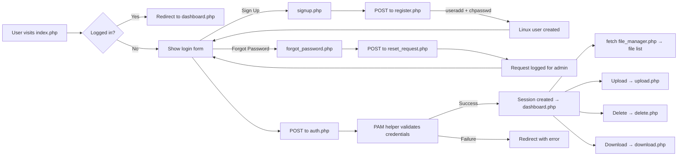

# PITS Archival System — Walkthrough

## Files Created

| File | Purpose |
|------|---------|
| `config.php` | Constants (quotas, paths, admin list), helper functions (sanitize, path check, dir size) |
| `session.php` | Session guard — `require_login()`, `is_admin()`, `get_username()` |
| `pam_auth_helper.sh` | Shell script to validate Linux credentials via `su` |
| `auth.php` | Login handler — sanitizes input, rate limits (5/10min), calls PAM helper, sets session |
| `logout.php` | Destroys session, clears cookie, redirects to login |
| `file_manager.php` | Returns JSON: file list + quota usage from user's directory |
| `upload.php` | Handles file upload with size/quota validation, filename sanitization |
| `delete.php` | Deletes selected files with path traversal prevention |
| `download.php` | Serves file downloads with `realpath()` safety check |
| `index.php` | Login page — form posts to `auth.php`, links to Sign Up and Forgot Password |
| `signup.php` | Sign-up page — "Create new Account" form, posts to `register.php` |
| `register.php` | Registration handler — creates Linux user via `useradd` + `chpasswd`, sets home dir permissions |
| `forgot_password.php` | Forgot password page — collects username and email, posts to `reset_request.php` |
| `reset_request.php` | Reset handler — validates user exists, logs request to `/tmp/pits_reset_requests.log` for admin review |
| `dashboard.php` | File manager page — fetches files via JS, upload/delete/download buttons, quota bar |
| `SETUP.md` | Debian server deployment guide |
| `pits-auth-ui.html` | Original static mockup (kept as reference) |

## Request Flow



## Security Features

- **Path traversal blocked**: `realpath()` + `basename()` checks on all file operations
- **Input sanitization**: Username limited to `[a-zA-Z0-9_]{1,32}`, filenames stripped of special chars
- **Rate limiting**: 5 login attempts per IP per 10 minutes
- **Command injection**: `escapeshellarg()` on all shell arguments
- **Session security**: `httponly`, `samesite=Strict`, `session_regenerate_id()` on login

## Deployment

Follow [SETUP.md](SETUP.md) to deploy on your Debian VM. Key steps:
1. Copy all files to `/var/www/html/`
2. Set `pam_auth_helper.sh` permissions + sudoers rule for PAM auth
3. Set sudoers rule for sign-up (`useradd`, `chpasswd`):
   ```
   sudo visudo -f /etc/sudoers.d/pits-register
   www-data ALL=(root) NOPASSWD: /usr/sbin/useradd, /usr/sbin/chpasswd
   ```
4. Configure PHP `upload_max_filesize` = 50M in `/etc/php/*/apache2/php.ini`
5. Set user home directory permissions for `www-data`
6. Ensure `/srv/project` exists with `www-data` group write access

## Page Navigation

```
Login (index.php)
  ├── "Sign Up" ──────────→ signup.php ──→ register.php ──→ creates Linux user
  ├── "Forgot Password?" ─→ forgot_password.php ──→ reset_request.php ──→ logs for admin
  └── Submit ─────────────→ auth.php ──→ dashboard.php

Dashboard (dashboard.php)
  ├── Upload ──→ upload.php ──→ /srv/project (admin) or /home/<user>
  ├── Delete ──→ delete.php
  ├── Download → download.php
  └── Logout ──→ logout.php ──→ index.php
```
